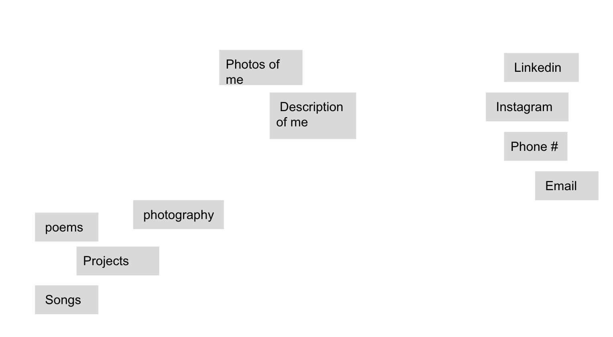
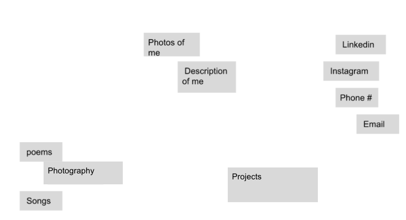
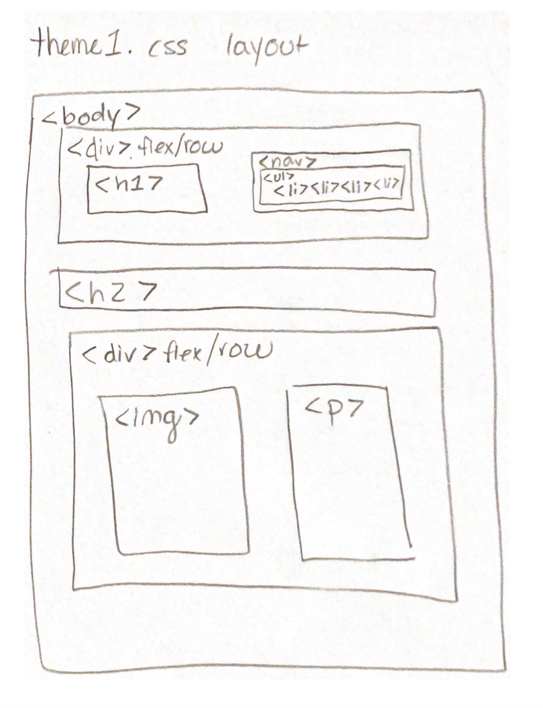
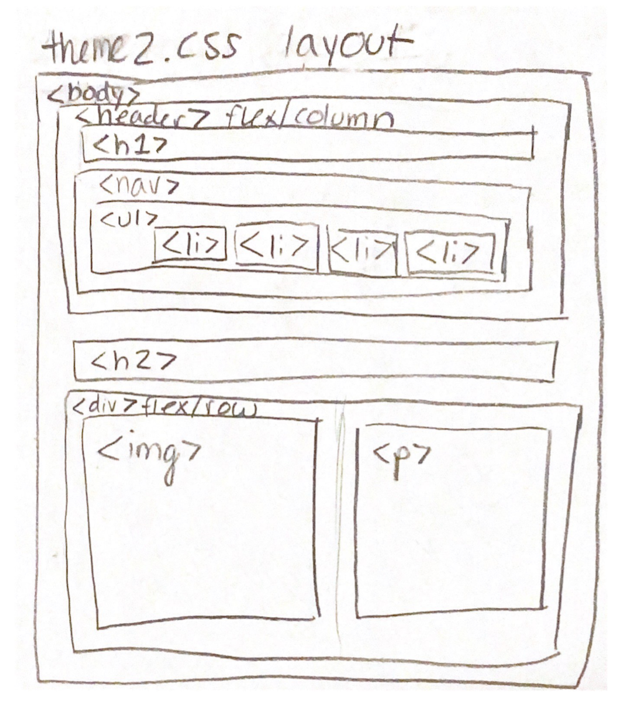
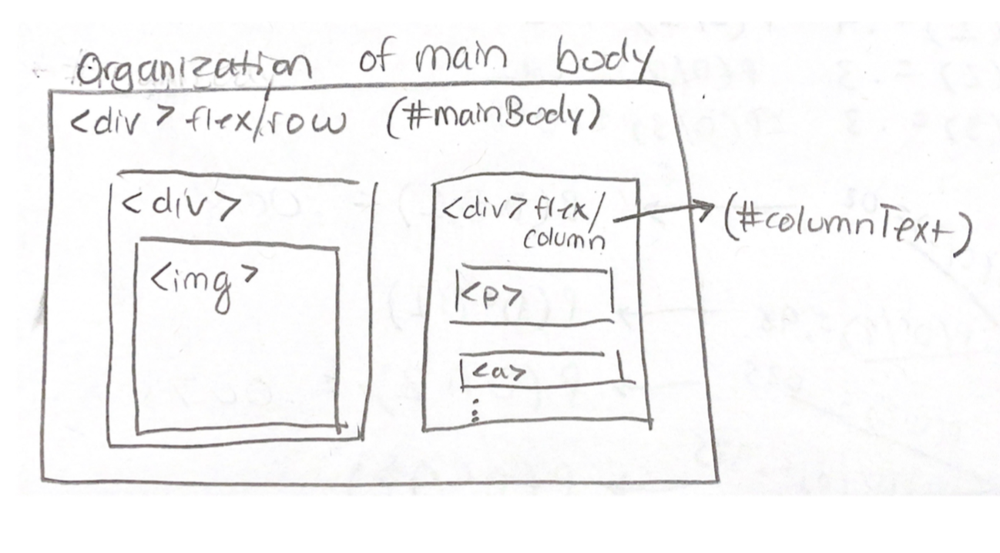
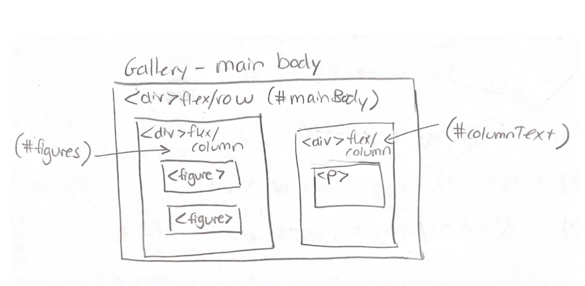

# Project 1: Design Journey

**For each milestone, complete only the sections that are labeled with that milestone.**

Be clear and concise in your writing. Bullets points are encouraged.

**Everything, including images, must be visible in Markdown Preview.** If it's not visible in Markdown Preview, then we won't grade it. We won't give you partial credit either. This is your warning.

## Audience & Content

**Make the case for your decisions using concepts from class, as well as other design principles, theories, examples, and cases from outside of class.**

You can use bullet points and lists, or full paragraphs, or a combo, whichever is appropriate. The writing should be solid draft quality but doesn't have to be fancy.

**No sketches are required for Milestone 1.**

### Website Topic (Milestone 1)
> Briefly explain what your website will be about.

My website will be a personal website to demonstrate my achievements and hobbies!

### Audience (Milestone 1)
> Briefly explain who the intended audience(s) is for your website. Be specific and justify why this audience is appropriate for your site's topic.

My website is intended for future employers in the field of music, employers in the tech industry, college students involved in clubs that have to do with music and tech, and family/friends who want to keep up with my life in college.

### Final Content (Milestone 1)
> Briefly describe the content you plan to include in the final site, and why it's the right content for your audiences.

I plan to include information about myself, ways to contact me, and a gallery for creative work/projects. This is the right content for my audience because it showcases my creative ability and qualifications for employers and ways to easily get in touch with me.

### Home Page Content (Milestone 1)
> Briefly identify what content you will include on the homepage and why this content should be the first thing your target audience sees when they visit your site.

I will include some pictures and a description of myself. This should be the first thing my audince will see because that will grab their attention and give them some quick information if they are an employer with limited time.

## Information Architecture

**Make the case for your decisions using concepts from class, as well as other design principles, theories, examples, and cases from outside of class.**

Each section is probably around 1 reasonably sized paragraph (2-4 sentences).

**No sketches are required for Milestone 2.**

### Audience (Milestone 2)
> A clearer description of audience: who are they, what are they interested in with respect to this site, and what are the design goals for that audience.

The audience is made up of future employers who will be looking at my material and information to hopefully decide to hire me. Thus, they will be looking for an easy way to view my projects and qualifications. Another audience is that of my friends, family members, and colleages, who are simply curious to see my recent accomplishments and projects. For these people, I would take a more creative and simple approach. In terms of design, I would keep it very straightforward and elegant, but still keep a fun/youthful vibe.

### Organization & Navigation (Milestone 2)
> A description of how you generated and considered alternatives for the site's content organization and navigation. You are required to include images here of your card sorting for determining the organization of content and the navigation.

> Thoroughly document this process. The _process_ is the important part of this assignment, not the final result.]

Image of card sort. I placed all of the content of my site into cards, and then sorted them based on what made the most sense. To me, that was sorting them into creative projects, information about me, and contact info. These three pages will be linked on the homepage, which will simply welcome users to the site. The homepage may also include some photos. There will be links back to the homepage on each additional page.

Image of alternate card sort. Here is an image of an alternative card sort I considered, where I considered putting "projects" into its own category, because even though projects are a creative endeavor, I think they could fit in another whole category from my gallery. In the end, I decided I don't have enough material to make a whole new category, so I went back to my original idea of having 3 total categories.

### Final Organization and Navigation (Milestone 2)
> Explain how the final organization of content and navigation is appropriate for your target audiences.

The final organization of content and navigation is appropriate because it is split into three simple categories. A user should have no problem navigating to my gallery link, if that is what they are seeking. If they are seeking ways to contact me, it will all be in one place.

## Visual Design

**Make the case for your decisions using concepts from class, as well as other design principles, theories, examples, and cases from outside of class.**

Remember to focus on the things we can't see just by looking at the site: changes, alternatives considered, processes, and justifications.

Each section is probably around 1 reasonably sized paragraph (2-4 sentences).

### Theme Ideas (Milestone 3)
> Discuss several ideas about styling your site's theme. Explain why the theme ideas are appropriate for your target audiences. Feel free to include some hand-drawn sketches (not digital drawings, not mock-ups, not wireframes, etc.) here to document your design process.

My first theme is a simple, professional theme. This would entail a black or dark grey background with white text, large sans-serif headers, and sans-serif paragraphs, with well spaced sections. The section headers colors would match the pictures on each page

My second theme is a creative yet professional theme. This would include white backgrounds with light, colorful headers, and black paragraph text. The headers would be sans-serif and the paragraphs would be serif. The sections would be spaced out so it looks organized.

### Theme Design (Milestone 3)
> Discuss your theme designs: how did you come to them, what are their strengths and weaknesses, how do they fit your overall design goals and audiences?

> Emotion is a big part of design. What emotions where you thinking about or trying to convey in your designs?

My first idea was to keep the theme super sleek and simple, to give off the appearance of professionalism and organization. I chose to do dark grey backgrounds with white text for the high contrast and also because of the first impression it would give the audience. In addition, the sans-serif gives off a modern vibe. However, I didn't think that would give off the impression I wanted to my audience. I want them to see the website and know that I am young and creative, so I'm thinking that the theme should be youthful and creative, yet still professional. For this, I would do a white background with headers that use colors that are light (probably pastel), and that match the pictures. They would be in sans-serif so that they appear modern and fun. The paragraphs would be written in a serif font to promote readability and professionalism, and would be written in black so the website isn't too amateur-looking.

## Rationale

**This rationale should be polished writing: one you might submit as a report to a client or boss to help explain the project and convince them you did a good job. You'll be surprised how much writing and communicating you need to do about projects and choices on internships and jobs; practice that here.**

It should be a comprehensive, complete story of the project. You might find that each section runs a few paragraphs (1-2). Sketches can often help tell the story of your design. Screenshots are also useful for describing issues discovered during the design process and how you addressed them.

**All images must be visible in Markdown Preview for credit!**

Your rationale should be a polished version of the earlier explanations.

### Site Layout (Final Submission)
> Show your design process and final layout for your site. You must include photos of your sketches of the layout. No digital drawings permitted.

> You must label each figure and provide an explanation of the sketch.

Sketch of version 1 of CSS layout. Users will be able to see the title of the page (my name) on the left of the header, with the navigation bar on the right of the header. In addition, users will see a picture to the left and a description of the page along with its title on the right.

Sketch of version 2 of CSS layout. Users will be able to see the name above the navigation bar in the header. In addition, users will see the title of the page, with a picture below this title to the left and a description of the page below it to the right.

I ended up going with version 2 because the header design was more natural with regards to the flow of the layout. I also realized that I would need to create flex-boxes within my flex-boxes to properly organize my paragraphs and links within the main content of the website.

Sketch of the organization of the main body. Here, I implemented a column flex-box in the right hand side of the main body (which is a row flex-box), as stated above.

Sketch of the organization of the gallery page. For the "Gallery" page, I had to implement a column flex-box on the left hand side of the page so that the figures could be better organized. If I were to add a new figure in the future, it would automatically sit below the existing ones, which makes organization much easier in the long run.

I had some issues with the images in my design, because the ratios would not maintain when they were resized, so I had to do some research in order to ultimately come up with a solution, which was simply to set their height and widths to auto. In addition, I had issues with the resizing of the links within the navigation bar, so I had to attempt to organize them in a few different ways before I settled on making each one take up 25% of the nav bar. Finally, with regards to my peer review, I ended up making changes to allow for a consistency of lowercase headers throughout the whole website.

### Audience (Final Submission)
> A complete and polished description of the intended audience(s) for your website.

The audience for my personal website will be made up of future employers in the field of technology or music who will be looking at the material on my webpage and information about me in order to find out more about me or make a decision whether or not to hire me. This website provides an easy, organzied way to allow them to view my projects and qualifications. Another audience that may view my personal website is one that is made up of my friends, family members, and colleages, who are simply curious with regards to my recent accomplishments and projects. Because these are two seperate audiences, my themes incorporate elements which would cater to both audiences.

### Design Goals (Final Submission)
> An explanation of the design goals for that audience, based on your earlier rationales.

The goal of my design process was to keep the theme very simple and organized, to allow the viewer's eye to easily navigate the page, while maintaining the appearance of youthfulness and creativity. My goal was for my audience to see my website and know that I am young and creative, yet still professional. To achieve this goal, I used a white background with headers that made use of whitespace and contrasting colors, which I matched with colors within some of the pictures. Thus, I went with a light green theme with subtle purple accents, because these colors convey the creative aspect of my website, while still keeping the theme consistent by bringing the whole page together in a fun way.

I used black, serif fonts for the paragraphs, in order to maintain readability and professionalism, but my headers were in sans-serif fonts to appear more modern and to grab the attention of the viewer. Mixing up the font families gives off the dynamic, flexible appearance that I was trying to achieve. In addition, I wanted there to be a balance of vibrant colors and greyscale, to avoid an amateur-like appearance.

### Navigation (Final Submission)
> An explanation of how the final navigation met your goals and why its appropriate for your audience(s).

My goal for the navigation was to keep each page as specific as possible, so that everything related could be found in one place. I implemented this goal by grouping each piece of content into related groups (or pages), and then linking these pages in the navigation bar atop the webpage. For example, my navigation bar allows a user to easily find my creative works by clicking on "gallery," a list of ways to contact me in one page (the "contact me" page), a few paragraphs of information on me in the "about me" page, and the homepage, which gives an overview to the website.

The navigation of my website is appropriate for both of my intended audiences. If a future employer views my website, they will be inclined to find out more about my qualifications, so they will click on the "about me" page. Once they have viewed that page, they might choose to view my creative works in the "gallery" page, depending on the job, and depending on their ultimate decision, they could easily click on the "contact me" page to get in touch with me very easily. On the other hand, if a friend, family member, or colleague visits my webpage, they can easily view my recent projects in the "gallery" page, and learn more about me by clicking on "about me." I included pictures on each page to give a personal touch to my website, and this would be appropriate for both audiences, because I want employers to associate a face with my name and qualifications, and I want friends and family to feel connected to me through my presence on the webpage.

### Organization (Final Submission)
> An explanation of how the final organization met your goals and why its appropriate for your audience(s).

My goal was to keep the website very simple and organized while maintaining a creative appearance, and my use of flex-boxes and div elements enabled me to reach that goal. On any given page, there are at least two flex-boxes to provide the utmost organization for users. The main body is split into two columns, and on most of the pages there is a picture or pictures on the left hand side, and a description of the page on the right hand side, to maintain consistency. The navigation bar is also consistent throughout the whole website, which adds to the simplicity and professionalism. Overall, both of my audiences will find my website very organized, whether they are trying to hire me or just browsing, because I maintained a very simple and consistent organization style.

### Visual Design (Final Submission)
> An explanation of how the final design met your goals and why its appropriate for your audience(s).

From one look at my website, a user will be able to tell that I am creative yet serious, professional yet youthful, and well balanced. This was my goal going into this project, and I think I achieved it with the overall use of balance throughout the webiste. This balance can be seen in many ways: the balance between the colors and the greyscale, between the serif and sans-serif fonts, and between the serious and creative content. I also think that the use of whitespace is very important to the flow of my website. Both of my intended audiences will find my design to be visually simple yet not too simple that it is boring, ensuring that they get the right impression of me.

### Self-Reflection (Final Submission)
> What did you learn from this assignment? What are some of your strengths and weaknesses?

A weakness I learned about myself through this process is my desire to use color everywhere. I had to tone it down on multiple occasions to preserve the professionalism of the website. I learned that it is really important to strike a balance between professionalism and creativity in order to give off the right impression to your audience in terms of both your personality and web-making skills. I also learned that a strength of mine is making sure that I do not give up on a certain design flaw until it is completely fixed. I spent a lot of time doing research on how to fix certain issues outlined above, and I think this is indicative of my strength as a web designer. In the beginning, I was afraid of the design element of this project, becuase I have experience with code but none with desing; however, I found it very rewarding in the end when my website came together, and upon reflection, the design came more naturally to me than I had expected.
